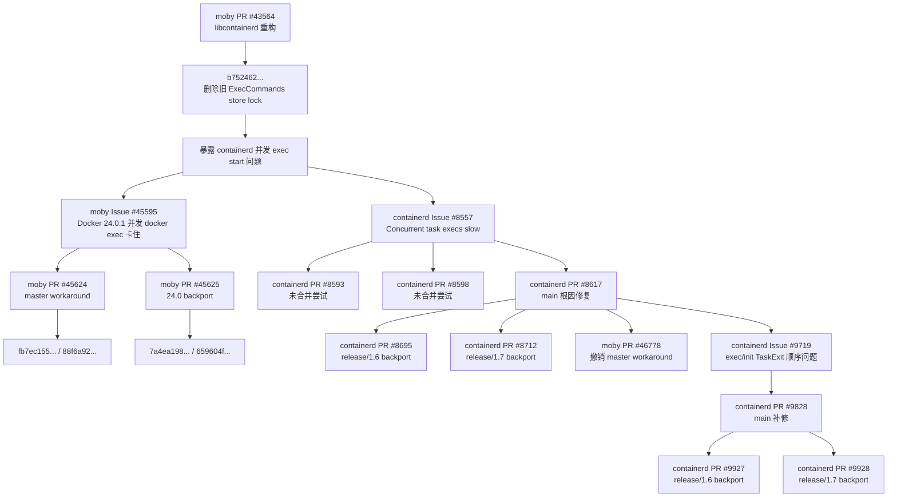

# PR #45624（master workaround）/ PR #45625（24.0 backport）及相关问题调研

## 结论先行

- 写法约定：`PR #数字` 表示 Pull Request / 代码变更与合入记录，`Issue #数字` 表示问题报告或跟踪项；跨仓库时显式写成 [moby PR #45624](https://github.com/moby/moby/pull/45624)、[containerd Issue #8557](https://github.com/containerd/containerd/issues/8557)。正文中会在 PR / Issue 后补充简短内容说明，Mermaid 图通过 `click` 指令补充跳转，表格保持紧凑标签。
- [moby PR #45624](https://github.com/moby/moby/pull/45624)（master workaround：串行化同一 task 的 exec start）和 [moby PR #45625](https://github.com/moby/moby/pull/45625)（24.0 backport：把同一 workaround 带到 Docker 24.0.x）是同一 workaround 的两条合入线：[moby PR #45624](https://github.com/moby/moby/pull/45624)（master 线）合入 `master`，[moby PR #45625](https://github.com/moby/moby/pull/45625)（24.0 线）cherry-pick 到 `24.0`。
- 两者共同处理 [moby Issue #45595](https://github.com/moby/moby/issues/45595)（Docker 24.0.1 并发 `docker exec` 导致 Docker 命令无响应）。Moby 侧做法是在 `libcontainerd` 中把同一 task 的 exec `Start()` 串行化，绕过 [containerd Issue #8557](https://github.com/containerd/containerd/issues/8557)（containerd 并发 exec start 极慢）。
- 根因不在 Moby，而在 containerd shim 的 start / exit 事件同步。真正修复是 [containerd PR #8617](https://github.com/containerd/containerd/pull/8617)（main 根因修复：移除粗粒度事件发送锁），并 backport 到 `release/1.6` 的 [containerd PR #8695](https://github.com/containerd/containerd/pull/8695)（1.6 backport）和 `release/1.7` 的 [containerd PR #8712](https://github.com/containerd/containerd/pull/8712)（1.7 backport）。
- Moby `master` 后续通过 [moby PR #46778](https://github.com/moby/moby/pull/46778)（撤销 master workaround，并提高 containerd 版本要求）撤销 workaround，因为支持的 containerd 分支已经修复；但 `24.0` 维护分支中的 [moby PR #45625](https://github.com/moby/moby/pull/45625)（24.0 backport）仍是 Docker 24.0.x 的发布修复路径。
- 本文中的正式版本 tag 只统计 `vX.Y.Z`，排除 `beta`、`rc`、`alpha`。所有正式 tag 列表基于 `/tmp` 临时 bare repo 中的 `git merge-base --is-ancestor` 对远端 tag 逐个验证。

## 关系图

说明：图中的 PR / Issue 节点均配置 Mermaid `click` 跳转；如果渲染环境不支持图内点击，可使用正文和表格中的普通 Markdown 链接。



## 合入 PR 与正式版本 Tag

下表只列已合入 PR。`合入 commit` 是 PR 合入目标仓库后呈现的 merge commit。`正式版本 tag` 只列正式 tag；长列表放在后文“正式 tag 附录”。

| PR | 合入仓库 / 分支 | 合入时间 UTC | 合入 commit | 正式版本 tag |
| --- | --- | --- | --- | --- |
| [moby PR #43564](https://github.com/moby/moby/pull/43564) | `moby/moby` / `master` | `2022-08-25T18:51:43Z` | [`0ec426a57b9bcdd6cbd6fe98f7e15ebfc12d0e14`](https://github.com/moby/moby/commit/0ec426a57b9bcdd6cbd6fe98f7e15ebfc12d0e14) | `MOBY-FROM-24.0.0` |
| [moby PR #45624](https://github.com/moby/moby/pull/45624) | `moby/moby` / `master` | `2023-05-25T21:02:34Z` | [`88f6a92d22ad8f0f931fb0b3509bbfb901db1579`](https://github.com/moby/moby/commit/88f6a92d22ad8f0f931fb0b3509bbfb901db1579) | `MOBY-FROM-25.0.0` |
| [moby PR #45625](https://github.com/moby/moby/pull/45625) | `moby/moby` / `24.0` | `2023-05-25T21:22:23Z` | [`659604f9ee60f147020bdd444b26e4b5c636dc28`](https://github.com/moby/moby/commit/659604f9ee60f147020bdd444b26e4b5c636dc28) | `MOBY-24.0.2+` |
| [moby PR #46778](https://github.com/moby/moby/pull/46778) | `moby/moby` / `master` | `2023-11-06T20:12:39Z` | [`796da163f92ad486a4f0118b4008d9bd17b27c2e`](https://github.com/moby/moby/commit/796da163f92ad486a4f0118b4008d9bd17b27c2e) | `MOBY-FROM-25.0.0` |
| [containerd PR #8617](https://github.com/containerd/containerd/pull/8617) | `containerd/containerd` / `main` | `2023-06-14T22:55:08Z` | [`ded713010c745c6e0010d7e0cec4dccd995e1a42`](https://github.com/containerd/containerd/commit/ded713010c745c6e0010d7e0cec4dccd995e1a42) | `CONTAINERD-FROM-2.0.0` |
| [containerd PR #8695](https://github.com/containerd/containerd/pull/8695) | `containerd/containerd` / `release/1.6` | `2023-06-16T19:51:43Z` | [`3a6c2c5603aa808683aa63c91b4c61000c33a530`](https://github.com/containerd/containerd/commit/3a6c2c5603aa808683aa63c91b4c61000c33a530) | `CONTAINERD-1.6.22+` |
| [containerd PR #8712](https://github.com/containerd/containerd/pull/8712) | `containerd/containerd` / `release/1.7` | `2023-07-03T13:37:55Z` | [`1bd9abd5af47f36b87b25594e526afbfb3a966b9`](https://github.com/containerd/containerd/commit/1bd9abd5af47f36b87b25594e526afbfb3a966b9) | `CONTAINERD-1.7.3+` |
| [containerd PR #9828](https://github.com/containerd/containerd/pull/9828) | `containerd/containerd` / `main` | `2024-03-04T18:14:55Z` | [`d3d4c5d2aec4dca83a48ff709c0f188cbf40d658`](https://github.com/containerd/containerd/commit/d3d4c5d2aec4dca83a48ff709c0f188cbf40d658) | `CONTAINERD-FROM-2.0.0` |
| [containerd PR #9927](https://github.com/containerd/containerd/pull/9927) | `containerd/containerd` / `release/1.6` | `2024-03-05T20:17:49Z` | [`367fa1a8c0da7ca2bb98337b7e134900b87d24df`](https://github.com/containerd/containerd/commit/367fa1a8c0da7ca2bb98337b7e134900b87d24df) | `CONTAINERD-1.6.29+` |
| [containerd PR #9928](https://github.com/containerd/containerd/pull/9928) | `containerd/containerd` / `release/1.7` | `2024-03-05T20:17:13Z` | [`69ca1b2871ca812c07f59bc533f997b3af7ffd73`](https://github.com/containerd/containerd/commit/69ca1b2871ca812c07f59bc533f997b3af7ffd73) | `CONTAINERD-1.7.14+` |

注意：[moby PR #45624](https://github.com/moby/moby/pull/45624)（添加 master workaround）与 [moby PR #46778](https://github.com/moby/moby/pull/46778)（撤销 master workaround）的正式 tag 集合相同，说明这些正式版本的历史同时包含“添加 workaround”和“撤销 workaround”。因此，`v25.0.0+` 中能看到 [moby PR #45624](https://github.com/moby/moby/pull/45624)（添加 workaround）的 merge commit，但最终行为以 [moby PR #46778](https://github.com/moby/moby/pull/46778)（撤销 workaround）后的代码为准。

## 主线时间线

| 时间 UTC | 类型 | 对象 | 事件 |
| --- | --- | --- | --- |
| `2017-07-04T03:18:03Z` | Issue | [moby Issue #33933](https://github.com/moby/moby/issues/33933) | healthcheck / exec 慢操作背景问题创建。 |
| `2022-05-04T23:00:55Z` | PR | [moby PR #43564](https://github.com/moby/moby/pull/43564) | libcontainerd 重构 PR 创建。 |
| `2022-08-25T18:51:43Z` | PR | [moby PR #43564](https://github.com/moby/moby/pull/43564) | 合入 `master`；其中 `b752462...` 删除旧锁。 |
| `2023-05-22T20:31:57Z` | Issue | [moby Issue #45595](https://github.com/moby/moby/issues/45595) | 报告 Docker 24.0.1 并发 `docker exec` 导致 Docker 无响应。 |
| `2023-05-23T18:36:33Z` | Issue | [containerd Issue #8557](https://github.com/containerd/containerd/issues/8557) | containerd 侧并发 exec start 极慢问题创建。 |
| `2023-05-25T20:09:23Z` | PR | [moby PR #45624](https://github.com/moby/moby/pull/45624) | Moby `master` workaround PR 创建。 |
| `2023-05-25T20:19:42Z` | PR | [moby PR #45625](https://github.com/moby/moby/pull/45625) | Moby `24.0` backport PR 创建。 |
| `2023-05-25T21:02:34Z` | PR | [moby PR #45624](https://github.com/moby/moby/pull/45624) | 合入 `master`。 |
| `2023-05-25T21:22:23Z` | PR | [moby PR #45625](https://github.com/moby/moby/pull/45625) | 合入 `24.0`。 |
| `2023-06-14T22:55:08Z` | PR | [containerd PR #8617](https://github.com/containerd/containerd/pull/8617) | containerd `main` 根因修复合入。 |
| `2023-06-16T19:51:43Z` | PR | [containerd PR #8695](https://github.com/containerd/containerd/pull/8695) | containerd `release/1.6` backport 合入。 |
| `2023-07-03T13:37:55Z` | PR | [containerd PR #8712](https://github.com/containerd/containerd/pull/8712) | containerd `release/1.7` backport 合入。 |
| `2023-11-06T20:12:39Z` | PR | [moby PR #46778](https://github.com/moby/moby/pull/46778) | Moby `master` 撤销 workaround。 |
| `2024-01-31T09:14:42Z` | Issue | [containerd Issue #9719](https://github.com/containerd/containerd/issues/9719) | [containerd PR #8617](https://github.com/containerd/containerd/pull/8617) 后续 exec/init `TaskExit` 顺序问题创建。 |
| `2024-03-04T18:14:55Z` | PR | [containerd PR #9828](https://github.com/containerd/containerd/pull/9828) | [containerd Issue #9719](https://github.com/containerd/containerd/issues/9719) 主线修复合入。 |
| `2024-03-05T20:17:49Z` | PR | [containerd PR #9927](https://github.com/containerd/containerd/pull/9927) | [containerd PR #9828](https://github.com/containerd/containerd/pull/9828) 的 `release/1.6` backport 合入。 |
| `2024-03-05T20:17:13Z` | PR | [containerd PR #9928](https://github.com/containerd/containerd/pull/9928) | [containerd PR #9828](https://github.com/containerd/containerd/pull/9828) 的 `release/1.7` backport 合入。 |

## Moby PR #45624（master workaround）/ PR #45625（24.0 backport）

### 解决的问题

[moby Issue #45595](https://github.com/moby/moby/issues/45595)（Docker 24.0.1 并发 `docker exec` 卡住）报告的是 Docker 24.0.1 中大量并发 `docker exec` 导致 Docker 命令无响应。复现环境为 Docker 24.0.1 + containerd 1.6.21，表现包括：

- `docker stats` 停止刷新并显示 `--`。
- `docker stop` 长时间无响应。
- CI 中本来约 10 分钟的测试拖到数小时并大量超时。

该 Issue（Docker 24.0.1 并发 `docker exec` 卡住）在 `2023-05-23T18:36:34Z` 交叉引用到 [containerd Issue #8557](https://github.com/containerd/containerd/issues/8557)（containerd 并发 exec start 极慢），在 `2023-05-25T20:09:24Z` / `2023-05-25T20:19:42Z` 分别交叉引用到 [moby PR #45624](https://github.com/moby/moby/pull/45624)（master workaround）/ [moby PR #45625](https://github.com/moby/moby/pull/45625)（24.0 backport），并在 `2023-05-25T21:02:36Z` 随 [moby PR #45624](https://github.com/moby/moby/pull/45624)（master workaround）合入关闭。

### 实现方式

[moby PR #45624](https://github.com/moby/moby/pull/45624)（master workaround）在 `libcontainerd/remote/client.go` 的 `task` 结构体中新增 `serializeExecStartsWorkaround sync.Mutex`，并把 exec process 的 `p.Start(ctx)` 包在锁内：

```go
err = func() error {
    t.serializeExecStartsWorkaround.Lock()
    defer t.serializeExecStartsWorkaround.Unlock()
    return p.Start(ctx)
}()
```

这不是提升并发能力，而是明确恢复“同一 task 内 exec start 串行化”，用吞吐换稳定性，临时绕过 containerd 的并发退化。[moby PR #45625](https://github.com/moby/moby/pull/45625)（24.0 backport）是相同代码的 `24.0` backport，patch 明确包含 `(cherry picked from commit fb7ec1555cca750f5d1d99bae5e99b4818712322)`。

## 背景 PR #43564（libcontainerd 重构）为什么重要

[moby PR #43564](https://github.com/moby/moby/pull/43564)（libcontainerd 重构：减少 containerd RPC）是 libcontainerd 重构，目标是减少 containerd RPC。它包含 commit [`b75246202ab9b1e5bb94c377f90db8ed38cfa0e0`](https://github.com/moby/moby/commit/b75246202ab9b1e5bb94c377f90db8ed38cfa0e0)，标题为 `Stop locking container exec store while starting`。

这个 commit 从 `daemon/exec.go` 删除了围绕 `daemon.containerd.Exec(...)` 的 `c.ExecCommands.Lock()` / `Unlock()`。从 Moby 自身语义看，这个锁确实不该保护 containerd exec start，因为 `daemon.containerd.Exec` 不访问 `ExecCommands` store；但该锁无意中把并发 exec start 串行化，掩盖了 containerd 侧 bug。[moby PR #45624](https://github.com/moby/moby/pull/45624)（master workaround）后来没有恢复旧 store lock，而是在 `libcontainerd` 中加了更直接的 per-task mutex。

## Containerd Issue #8557（并发 exec start 极慢）与修复 PR #8617（main）/ PR #8695（1.6 backport）/ PR #8712（1.7 backport）

[containerd Issue #8557](https://github.com/containerd/containerd/issues/8557)（containerd 并发 exec start 极慢）描述的是并发 `TaskService.Start()` 且设置 `ExecID` 时，exec start 会一起阻塞数秒到数分钟。

修复链：

- [containerd PR #8593](https://github.com/containerd/containerd/pull/8593)（未合入尝试：增大 reaper buffer）：尝试增大 reaper buffer，未合入。
- [containerd PR #8598](https://github.com/containerd/containerd/pull/8598)（未合入尝试：按 process 细化事件锁）：尝试按 process 细化事件锁，未合入，被 [containerd PR #8617](https://github.com/containerd/containerd/pull/8617)（main 根因修复）取代。
- [containerd PR #8617](https://github.com/containerd/containerd/pull/8617)（main 根因修复：移除粗粒度事件发送锁）：最终主线修复，合入 `main`。
- [containerd PR #8695](https://github.com/containerd/containerd/pull/8695)（1.6 backport）：[containerd PR #8617](https://github.com/containerd/containerd/pull/8617)（main 根因修复）的 `release/1.6` backport。
- [containerd PR #8712](https://github.com/containerd/containerd/pull/8712)（1.7 backport）：[containerd PR #8617](https://github.com/containerd/containerd/pull/8617)（main 根因修复）的 `release/1.7` backport。

[containerd PR #8617](https://github.com/containerd/containerd/pull/8617)（main 根因修复）的核心是替换 `eventSendMu` 这类粗粒度锁。旧逻辑为了维护 start / exit 事件顺序，在多个 process 并发 start 和 exit 时产生严重锁争用；新逻辑用 PID map 跟踪已发布 `TaskStart` 且尚未退出的 process，并对 early exit 做订阅处理，从而不再依赖大锁维护因果关系。

## Moby PR #46778（撤销 master workaround）

[moby PR #46778](https://github.com/moby/moby/pull/46778)（撤销 master workaround，并提高 containerd 版本要求）撤销 [moby PR #45624](https://github.com/moby/moby/pull/45624)（master workaround）引入的 mutex workaround。理由是支持的 containerd 分支已经包含 [containerd Issue #8557](https://github.com/containerd/containerd/issues/8557)（containerd 并发 exec start 极慢）的修复。

它同时修改 `project/PACKAGERS.md`，要求：

- `containerd version 1.6.22 or later`
- `containerd versions 1.7.0 through 1.7.2 are incompatible`

这与正式 tag 验证一致：containerd `release/1.6` 从 `v1.6.22` 开始包含 [containerd PR #8695](https://github.com/containerd/containerd/pull/8695)（1.6 backport），`release/1.7` 从 `v1.7.3` 开始包含 [containerd PR #8712](https://github.com/containerd/containerd/pull/8712)（1.7 backport）。

## 后续 Issue #9719（TaskExit 顺序问题）与补修 PR #9828（main）/ PR #9927（1.6 backport）/ PR #9928（1.7 backport）

[containerd PR #8617](https://github.com/containerd/containerd/pull/8617)（main 根因修复）修掉了 [containerd Issue #8557](https://github.com/containerd/containerd/issues/8557)（并发 exec start 极慢）的性能问题，但引出更细的事件顺序问题：[containerd Issue #9719](https://github.com/containerd/containerd/issues/9719)（exec/init `TaskExit` 顺序问题）。

该问题是：如果 exec 正在 start，同时 init process exit，containerd 必须保证对外先发 exec 的 `TaskExit`，再发 init 的 `TaskExit`。否则 Docker 可能先删除 container，再处理不到 exec exit。

相关 PR：

- [containerd PR #9775](https://github.com/containerd/containerd/pull/9775)（未合入尝试：修复 TaskExit 顺序）：未合入尝试，head commit [`972ea79eb212061955ca4136703970c3e39bbf75`](https://github.com/containerd/containerd/commit/972ea79eb212061955ca4136703970c3e39bbf75)。
- [containerd PR #9828](https://github.com/containerd/containerd/pull/9828)（main 补修：保证 exec/init `TaskExit` 顺序）：主线修复，合入 `main`。
- [containerd PR #9927](https://github.com/containerd/containerd/pull/9927)（1.6 backport：回迁 [containerd PR #9828](https://github.com/containerd/containerd/pull/9828) 的 TaskExit 顺序补修）：`release/1.6` backport。
- [containerd PR #9928](https://github.com/containerd/containerd/pull/9928)（1.7 backport：回迁 [containerd PR #9828](https://github.com/containerd/containerd/pull/9828) 的 TaskExit 顺序补修）：`release/1.7` backport。

[containerd Issue #9719](https://github.com/containerd/containerd/issues/9719)（exec/init `TaskExit` 顺序问题）的 timeline 还继续引用了更晚的 [containerd PR #10603](https://github.com/containerd/containerd/pull/10603)（后续 exit handling hardening）、[containerd PR #11587](https://github.com/containerd/containerd/pull/11587)（后续 exit handling / spec 相关调整）、[containerd PR #13049](https://github.com/containerd/containerd/pull/13049)（后续 exit handling / spec 相关调整）等工作。它们距离 [moby PR #45624](https://github.com/moby/moby/pull/45624)（master workaround）/ [moby PR #45625](https://github.com/moby/moby/pull/45625)（24.0 backport）的并发 exec start workaround 主链较远，本文只记录为后续关联。

## 正式 Tag 附录

以下 tag 集合均通过 `/tmp` 临时 bare repo 中的 `git merge-base --is-ancestor <merge-commit> <tag>` 对全部正式 tag 验证得到。

### Moby

`MOBY-FROM-24.0.0`：[moby PR #43564](https://github.com/moby/moby/pull/43564)（libcontainerd 重构）

```text
v24.0.0, v24.0.1, v24.0.2, v24.0.3, v24.0.4, v24.0.5, v24.0.6, v24.0.7, v24.0.8, v24.0.9,
v25.0.0, v25.0.1, v25.0.2, v25.0.3, v25.0.4, v25.0.5, v25.0.6, v25.0.7, v25.0.8, v25.0.9, v25.0.10, v25.0.11, v25.0.12, v25.0.13, v25.0.14, v25.0.15, v25.0.16,
v26.0.0, v26.0.1, v26.0.2, v26.1.0, v26.1.1, v26.1.2, v26.1.3, v26.1.4, v26.1.5,
v27.0.1, v27.0.2, v27.0.3, v27.1.0, v27.1.1, v27.1.2, v27.2.0, v27.2.1, v27.3.0, v27.3.1, v27.4.0, v27.4.1, v27.5.0, v27.5.1,
v28.0.0, v28.0.1, v28.0.2, v28.0.3, v28.0.4, v28.1.0, v28.1.1, v28.2.0, v28.2.1, v28.2.2, v28.3.0, v28.3.1, v28.3.2, v28.3.3, v28.4.0, v28.5.0, v28.5.1, v28.5.2
```

`MOBY-FROM-25.0.0`：[moby PR #45624](https://github.com/moby/moby/pull/45624)（添加 master workaround）、[moby PR #46778](https://github.com/moby/moby/pull/46778)（撤销 master workaround）

```text
v25.0.0, v25.0.1, v25.0.2, v25.0.3, v25.0.4, v25.0.5, v25.0.6, v25.0.7, v25.0.8, v25.0.9, v25.0.10, v25.0.11, v25.0.12, v25.0.13, v25.0.14, v25.0.15, v25.0.16,
v26.0.0, v26.0.1, v26.0.2, v26.1.0, v26.1.1, v26.1.2, v26.1.3, v26.1.4, v26.1.5,
v27.0.1, v27.0.2, v27.0.3, v27.1.0, v27.1.1, v27.1.2, v27.2.0, v27.2.1, v27.3.0, v27.3.1, v27.4.0, v27.4.1, v27.5.0, v27.5.1,
v28.0.0, v28.0.1, v28.0.2, v28.0.3, v28.0.4, v28.1.0, v28.1.1, v28.2.0, v28.2.1, v28.2.2, v28.3.0, v28.3.1, v28.3.2, v28.3.3, v28.4.0, v28.5.0, v28.5.1, v28.5.2
```

`MOBY-24.0.2+`：[moby PR #45625](https://github.com/moby/moby/pull/45625)（24.0 backport）

```text
v24.0.2, v24.0.3, v24.0.4, v24.0.5, v24.0.6, v24.0.7, v24.0.8, v24.0.9
```

#### 问答：PR #46778 未回合到 24.0 会影响 24.0 吗

问题：[moby PR #46778](https://github.com/moby/moby/pull/46778)（撤销 master workaround）没有回合到 `24.0` 分支，会对 Docker 24.0.x 产生什么影响？

结论：不会产生负面 correctness 影响。更准确地说，`24.0` 分支因为没有合入 [moby PR #46778](https://github.com/moby/moby/pull/46778)（撤销 master workaround），所以继续保留 [moby PR #45625](https://github.com/moby/moby/pull/45625)（24.0 backport）带来的 Moby 侧 workaround。

[moby PR #46778](https://github.com/moby/moby/pull/46778)（撤销 master workaround）不是修复 `24.0` 的必要补丁，而是 `master` 线在 containerd 已修复后删除临时锁的清理补丁。对 `24.0` 来说，不回合该 PR 是更保守的维护策略：继续兼容未修复 [containerd Issue #8557](https://github.com/containerd/containerd/issues/8557)（并发 exec start 极慢）的 containerd 版本，避免重新暴露大量并发 `docker exec` 卡住的问题。

版本影响可以分开看：

- Docker 24.0.0 / 24.0.1：尚未包含 [moby PR #45625](https://github.com/moby/moby/pull/45625)（24.0 backport），在 containerd 1.6.21 等未修复版本上会暴露并发 `docker exec` 卡住问题。
- Docker 24.0.2+：包含 [moby PR #45625](https://github.com/moby/moby/pull/45625)（24.0 backport），会在 Moby `libcontainerd` 层串行化同一 task 的 exec `Start()`。因此，即使底层 containerd 尚未包含 [containerd PR #8617](https://github.com/containerd/containerd/pull/8617)（main 根因修复）、[containerd PR #8695](https://github.com/containerd/containerd/pull/8695)（1.6 backport）或 [containerd PR #8712](https://github.com/containerd/containerd/pull/8712)（1.7 backport），也能绕过这个问题。
- Docker 25.0+：历史中同时包含 [moby PR #45624](https://github.com/moby/moby/pull/45624)（添加 master workaround）和 [moby PR #46778](https://github.com/moby/moby/pull/46778)（撤销 master workaround），最终行为依赖 containerd 版本下限解决，而不是依赖 Moby 侧串行化 workaround。

保留 workaround 的代价是：同一容器内大量并发 `docker exec` start 会被串行化，极端并发场景吞吐可能低一些；普通使用基本无感。如果把 [moby PR #46778](https://github.com/moby/moby/pull/46778)（撤销 master workaround）回合到 `24.0`，反而可能有风险，因为 `24.0` 用户或发行版未必都强制使用 containerd `1.6.22+` 或 `1.7.3+`。一旦删除 workaround，旧 containerd 组合就可能重新暴露 [containerd Issue #8557](https://github.com/containerd/containerd/issues/8557)（并发 exec start 极慢）。


### Containerd

`CONTAINERD-FROM-2.0.0`：[containerd PR #8617](https://github.com/containerd/containerd/pull/8617)（并发 exec start 根因修复）、[containerd PR #9828](https://github.com/containerd/containerd/pull/9828)（TaskExit 顺序补修）

```text
v2.0.0, v2.0.1, v2.0.2, v2.0.3, v2.0.4, v2.0.5, v2.0.6, v2.0.7, v2.0.8, v2.0.9,
v2.1.0, v2.1.1, v2.1.2, v2.1.3, v2.1.4, v2.1.5, v2.1.6, v2.1.7, v2.1.8,
v2.2.0, v2.2.1, v2.2.2, v2.2.3, v2.2.4,
v2.3.0, v2.3.1
```

`CONTAINERD-1.6.22+`：[containerd PR #8695](https://github.com/containerd/containerd/pull/8695)（[containerd PR #8617](https://github.com/containerd/containerd/pull/8617) 并发 exec start 根因修复的 1.6 backport）

```text
v1.6.22, v1.6.23, v1.6.24, v1.6.25, v1.6.26, v1.6.27, v1.6.28, v1.6.29, v1.6.30, v1.6.31, v1.6.32, v1.6.33, v1.6.34, v1.6.35, v1.6.36, v1.6.37, v1.6.38, v1.6.39
```

`CONTAINERD-1.7.3+`：[containerd PR #8712](https://github.com/containerd/containerd/pull/8712)（[containerd PR #8617](https://github.com/containerd/containerd/pull/8617) 并发 exec start 根因修复的 1.7 backport）

```text
v1.7.3, v1.7.4, v1.7.5, v1.7.6, v1.7.7, v1.7.8, v1.7.9, v1.7.10, v1.7.11, v1.7.12, v1.7.13, v1.7.14, v1.7.15, v1.7.16, v1.7.17, v1.7.18, v1.7.19, v1.7.20, v1.7.21, v1.7.22, v1.7.23, v1.7.24, v1.7.25, v1.7.26, v1.7.27, v1.7.28, v1.7.29, v1.7.30, v1.7.31, v1.7.32
```

`CONTAINERD-1.6.29+`：[containerd PR #9927](https://github.com/containerd/containerd/pull/9927)（[containerd PR #9828](https://github.com/containerd/containerd/pull/9828) TaskExit 顺序补修的 1.6 backport）

```text
v1.6.29, v1.6.30, v1.6.31, v1.6.32, v1.6.33, v1.6.34, v1.6.35, v1.6.36, v1.6.37, v1.6.38, v1.6.39
```

`CONTAINERD-1.7.14+`：[containerd PR #9928](https://github.com/containerd/containerd/pull/9928)（[containerd PR #9828](https://github.com/containerd/containerd/pull/9828) TaskExit 顺序补修的 1.7 backport）

```text
v1.7.14, v1.7.15, v1.7.16, v1.7.17, v1.7.18, v1.7.19, v1.7.20, v1.7.21, v1.7.22, v1.7.23, v1.7.24, v1.7.25, v1.7.26, v1.7.27, v1.7.28, v1.7.29, v1.7.30, v1.7.31, v1.7.32
```

## 对 execid leak 分析的含义

这组 PR 主要处理并发 `exec start` 的性能退化和 containerd shim 事件顺序问题，不是直接修复 ExecID 生命周期泄漏。但它们对 ExecID leak 分析有三点价值：

- `docker exec` 的问题域跨越 Moby daemon exec store、`libcontainerd` client 和 containerd shim，不能只看 Moby 的 exec map。
- 一个在 Moby 层“不必要”的锁可能在系统行为上掩盖 containerd bug；分析锁变更时必须把下游 runtime 行为纳入。
- Moby `master` 最终选择撤销 workaround，并通过 containerd 版本下限约束解决问题；而 Docker 24.0.x 通过 [moby PR #45625](https://github.com/moby/moby/pull/45625)（24.0 backport）发布 workaround。
- [moby PR #46778](https://github.com/moby/moby/pull/46778)（撤销 master workaround）未回合到 `24.0` 是保守选择：`24.0.2+` 继续保留 workaround，避免旧 containerd 组合重新暴露并发 `docker exec` 卡住问题。

## 附录问答：Docker v1.13.1 是否兼容 containerd 1.6.2

问题：Docker `v1.13.1` 是否兼容 containerd `1.6.2`？如果“containerd 1.62”指的是 `1.6.2`，结论是：不兼容，也不应尝试把 Docker `v1.13.1` 的运行时替换成现代 containerd `1.6.2`。

Docker `v1.13.1` 绑定的是旧 `docker/containerd` 体系，而不是现代 `containerd/containerd` 1.x 体系。证据如下：

- [`vendor.conf`](https://raw.githubusercontent.com/moby/moby/v1.13.1/vendor.conf) 固定依赖 `github.com/docker/containerd aa8187dbd3b7ad67d8e5e3a15115d3eef43a7ed1`。
- [`hack/dockerfile/binaries-commits`](https://raw.githubusercontent.com/moby/moby/v1.13.1/hack/dockerfile/binaries-commits) 固定 `CONTAINERD_COMMIT=aa8187dbd3b7ad67d8e5e3a15115d3eef43a7ed1`。
- [`hack/dockerfile/install-binaries.sh`](https://raw.githubusercontent.com/moby/moby/v1.13.1/hack/dockerfile/install-binaries.sh) 从 `https://github.com/docker/containerd.git` 构建，并安装为 `docker-containerd`、`docker-containerd-shim`、`docker-containerd-ctr`。

这个 commit 属于 2017 年旧 containerd 代码线，仓库和 API 形态都不同于现代 `github.com/containerd/containerd` 的 `1.6.x`。因此，Docker `v1.13.1` 不是“可自由搭配任意 containerd 版本”的架构，它绑定的是旧 `docker/containerd` commit 和旧 gRPC API；containerd `1.6.2` 不是 drop-in replacement。

实际影响：

- 如果系统里额外安装了 containerd `1.6.2`，但 Docker `v1.13.1` 仍使用自己配套的 `docker-containerd`，这不代表两者兼容，只是可能互不使用。
- 如果强行让 Docker `v1.13.1` 使用 containerd `1.6.2`，大概率会因为 API、socket、shim、二进制名称和行为差异而失败。
- 正确做法是：Docker `v1.13.1` 使用它配套的旧 `docker-containerd`；如果必须使用 containerd `1.6.x`，应升级 Docker Engine 到支持该代 containerd 的版本。

## 附录问答：containerd 1.6.22 / 1.6.33 兼容哪些 Docker 版本

问题：containerd `1.6.22` 和 containerd `1.6.33` 分别兼容哪些 Docker 版本？

结论先行：按 Moby `project/PACKAGERS.md` 的运行时依赖声明，Docker/Moby `v25.0.0` 到当前已验证的 `v28.5.2` 正式 tag 均兼容 containerd `1.6.22` 和 containerd `1.6.33`。原因是这些版本都声明 `containerd version 1.6.22 or later`，且仅排除 `containerd 1.7.0` 到 `1.7.2`；containerd `1.6.33` 属于 `1.6.x` patch 线，满足 `>= 1.6.22`。

| containerd 版本 | 明确兼容的 Docker / Moby 正式版本 | 依据与说明 |
| --- | --- | --- |
| `1.6.22` | `v25.0.0` - `v25.0.16`、`v26.0.0` - `v26.1.5`、`v27.0.1` - `v27.5.1`、`v28.0.0` - `v28.5.2` | 这些 tag 的 `project/PACKAGERS.md` 均声明 `containerd version 1.6.22 or later`。 |
| `1.6.33` | `v25.0.0` - `v25.0.16`、`v26.0.0` - `v26.1.5`、`v27.0.1` - `v27.5.1`、`v28.0.0` - `v28.5.2` | 同样满足 `containerd >= 1.6.22`；它是 `1.6.x` 后续 patch 版本，不属于被排除的 `1.7.0` - `1.7.2`。 |

补充看 Docker `24.0.x`：

- `v24.0.0` - `v24.0.5` 源码依赖中的 `github.com/containerd/containerd` 是 `v1.6.21`。
- `v24.0.6` - `v24.0.9` 源码依赖中的 `github.com/containerd/containerd` 是 `v1.6.22`，与 containerd `1.6.22` 直接对齐。
- `v24.0.2+` 已包含 [moby PR #45625](https://github.com/moby/moby/pull/45625)（24.0 backport workaround），因此对未修复的 containerd 组合也保留 Moby 侧保护；但 `24.0.x` 的 `project/PACKAGERS.md` 没有像 `v25.0.0+` 那样显式写出 `containerd >= 1.6.22` 的运行时依赖声明。

因此，如果要求“有明确运行时依赖声明”的兼容版本，给出 `Docker/Moby v25.0.0` 到 `v28.5.2`。如果是在 Docker `24.0.x` 维护线内看源码依赖对齐，则 `v24.0.6` 到 `v24.0.9` 已直接使用 containerd client `v1.6.22`；containerd `1.6.33` 作为同一 `1.6.x` patch 线通常可作为运行时 patch 升级，但这不是 `24.0.x` 文档中显式声明的最低运行时要求。

注意：这里说的是 Moby/Docker Engine 源码和运行时依赖层面的兼容性。具体发行版包（例如 `docker-ce` 与 `containerd.io`）可能还有自己的包依赖范围或 pinning；如果是在某个 distro 上安装，应再检查对应包管理器的依赖元数据。
